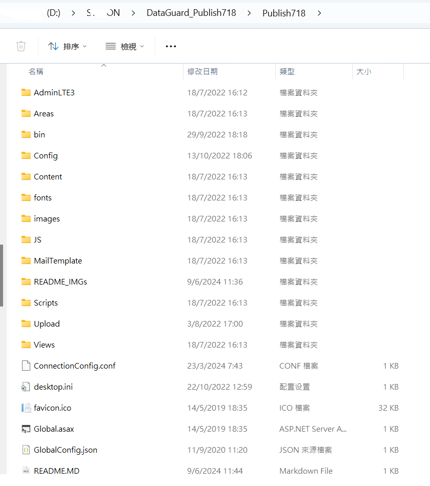

# 考勤系統 .NET 4.8 MVC

整理與2024-6-9

這是發佈版本,非代碼版本

```
代碼版本在: https://github.com/tonylaw2008/DataGuardVI
```

基於C#/jQuery3.1/AngularJS/MVC .NET 4.8 框架的一套考勤系統

1. 不包括薪酬計算
2. 工人導入
3. 排班計算
4. 基礎數據:部門,工種,分判(分公司/連鎖)


